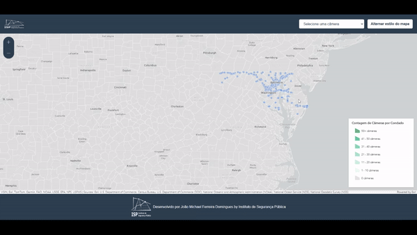

# Mapa de Câmeras de Tráfego por Condado

Este projeto exibe um mapa interativo dos condados dos EUA, onde é possível visualizar a quantidade de câmeras de tráfego por condado através de pop-ups. Cada condado, ao ser clicado, exibe um pop-up com detalhes de localização e uma contagem de câmeras. A interface também inclui uma lista de câmeras e um botão para alternar o estilo do mapa.

## Funcionalidades Principais

### 1. Visualização do Mapa e Camadas

O projeto utiliza **MapView** para exibir o mapa com as seguintes camadas:
- **Camada de Câmeras:** Exibe pontos de câmeras de tráfego no mapa.
- **Camada de Condados:** Mostra os limites dos condados. Embora a função de cor por contagem de câmeras esteja implementada, ela não está refletindo no mapa atualmente.

### 2. Pop-up com Informações de Câmeras por Condado

Ao clicar em um condado, o mapa exibe um **pop-up** com as seguintes informações:
- **Nome do Condado** e **Estado**.
- **Contagem de Câmeras:** Número de câmeras no condado, obtido em tempo real.
- **Indicador de Cor**: Uma caixa colorida que reflete a contagem, de acordo com a legenda.

### 3. Seleção de Câmeras e Mudança de Estilo

No topo do mapa, há um **seletor de câmeras** que permite escolher uma localização específica de câmera, centralizando-a automaticamente no mapa. Além disso, o botão **Alternar estilo do mapa** permite a mudança entre o estilo de mapa "streets" e "gray-vector".

### 4. Detalhes de Implementação

- **Camada de Câmeras:** Cada câmera exibe um pop-up customizado com localização exata e link.
- **Legenda:** Embora a legenda do mapa defina cores por faixas de contagem de câmeras, as cores não estão aplicadas diretamente nos condados atualmente.
- **Sincronização entre Pop-up e Legenda**: O pop-up do condado exibe a mesma cor de fundo da legenda correspondente à contagem de câmeras, para clareza visual.

## Estrutura do Código

- **HTML**: Configura o contêiner do mapa e os elementos de interface.
- **CSS**: Estiliza o layout, pop-ups, e os controles de mapa.
- **JavaScript**: Usa a API ArcGIS para criar o mapa, sincronizar o seletor de câmeras e atualizar os pop-ups.

## Como Executar

1. Clone este repositório.
2. Abra o arquivo `index.html` em seu navegador ou hospede o projeto com uma plataforma compatível como **Vercel**.
3. Interaja com o mapa clicando nos condados ou selecionando câmeras na lista.

## Projeto Completo

 ## Mapa de Câmeras de Tráfego por Condado [Video](https://www.youtube.com/watch?v=FTFPAFBkrAg)

---

